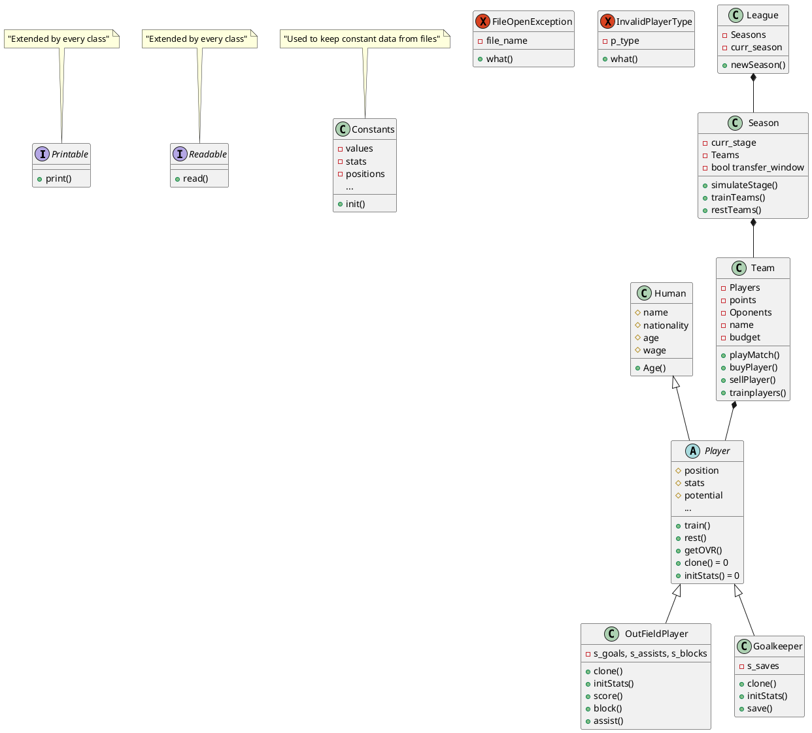

# FKHS - Football King of the Hill Simulator

## This app will generate a league starting with 21 teams and will end with only the one who manages to survive

### Reasoning and Inspiration

This is a project for the **Object Oriented Programming** class and is inspired from the **FIFA games carrer mode**, main differences being that teams are "randomly generated" and that this app only simulates matches.

### Introduction

The app starts by generating the teams and players for the league, every week teams will play matches, train their players and rest them.
Mid season the **transfer window** emerges and teams can buy and sell players for a period of 4 weeks(4 matches). Mid season is also the time for **player potential** changes, the top half get potential boosts, the bottom half get nerfs. At the end of the season the last three teams are *relegated*(removed from the league) and so after a few seasons we will have our **KING TEAM**.

### App Features

- [x] generates players and teams "randomly"
- [ ] simulates matches between teams
- [ ] keeps the history of every season played so far
- [ ] eliminates after each season the last 3 teams in the league
- [ ] dynamic potential for the players
- [x] dynamic stats for players
- [ ] dynamic team determination before match

#### Implementation
<!--

-->
